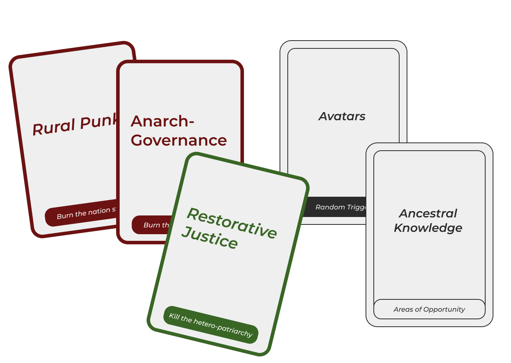
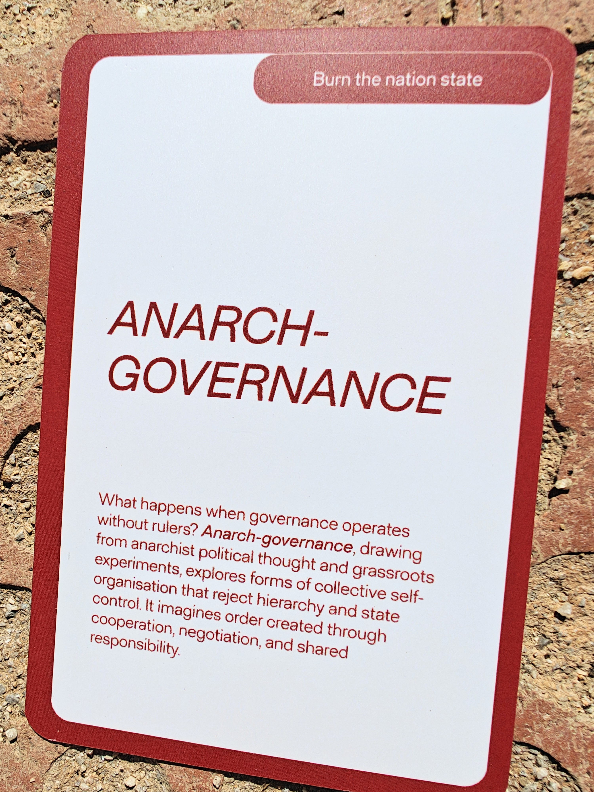
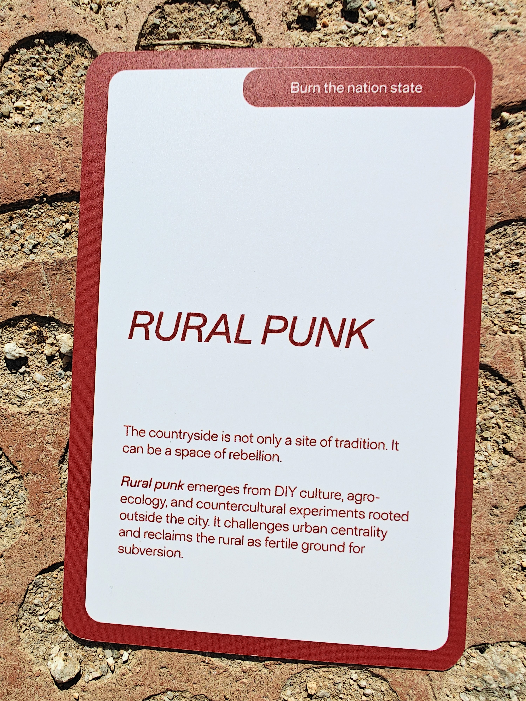
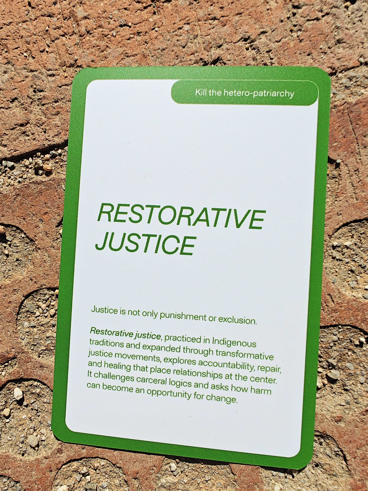
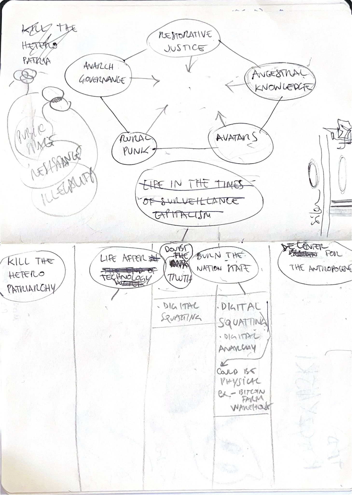
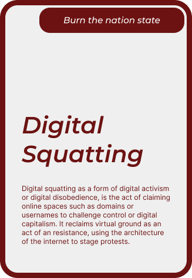

# Atlas of Weak Signals

A weak signal is much like a butterfly effect. The small things we notice in today's world that could influence, transform or even define the future. We began the process of working with new weak signals by picking existing cards from the deck. The deck consists of cards that are more suggestive than direct signals organised into a few overarching themes. The themes we began with were:

These broad themes were already fascinating and inspiring and we were excited to flip the cards. The cards we got consisted of 3 weak signals, 1 area of opportunity and 1 random trigger.

Each of the cards felt relevant, but their interconnections are what fascinated us the most. They instantly triggered fascinating conversation in the context of Torre Barros and the stories of past politics, communities and their forms of revolution, and the symbols and symbolism involved through this. I have briefly described what went through my mind for each weak signal and their relevance to me.

??? tip "Anarch-Governance"

    !!! abstract ""

        Today's political atmosphere is rotten across the world. With regimes throttling free speech and a variety of other freedoms under the disguise of official and formal governance, the idea of a governance built of chaos, one run by the people having faith that they may respect their own best-interests, while making a better world for each other takes root in the mind of the people. Would it work? Maybe... maybe not. But maybe a false dream is better than a bad truth.

    

??? tip "Rural Punk"

    !!! abstract ""

        The most unexpected and incredible solutions come from adversity. From culture and identity trying to answer problems left behind by large scale systems. The idea of a truly modern village to replace the idea of a rumbling machine-led gas spewing city is gaining relevance in an age where our metropolitan cities are wracked by problems that were not planned for or predicted. Great yet simple concepts, designs and solutions keep emerging in rural areas as they solve their own problems, not being in the purview of the exploding progress of the modern world, yet needing to move forward to keep up with its neverending hunger.

    

??? tip "Restorative Justice"

    !!! abstract ""

        In constantly othering those that are not similar to us or who do not agree with our views, we ensure that it stays that way. We all believe we are right and we always fight the other to agree that they are wrong. Traditional ideas of justice move far beyond this narrow thinking. An opportunity for change. A silver lining, allows every storm to usher in a new change.

    

For the next step, we had to use the area of opportunity and the random trigger to create a new card. We brainstormed quite a bit while trying to bring all our insights together. After much deliberation, we created "Digital Squatting".

??? example "Brainstorming"

    

!!! tip "Digital Squatting - Our New Card"

    !!! abstract inline end ""

        A recurring theme throughout our conversations, we discussed how the digital world is the new gathering place, and how many forms of revolution, alternate systems of heirarchy and governance should be practiced there. A world that badly needs both the ideas of restoration and justice. A place to apply rural knowledge, a new world in which to practice some of the oldest forms of revolution.

    
