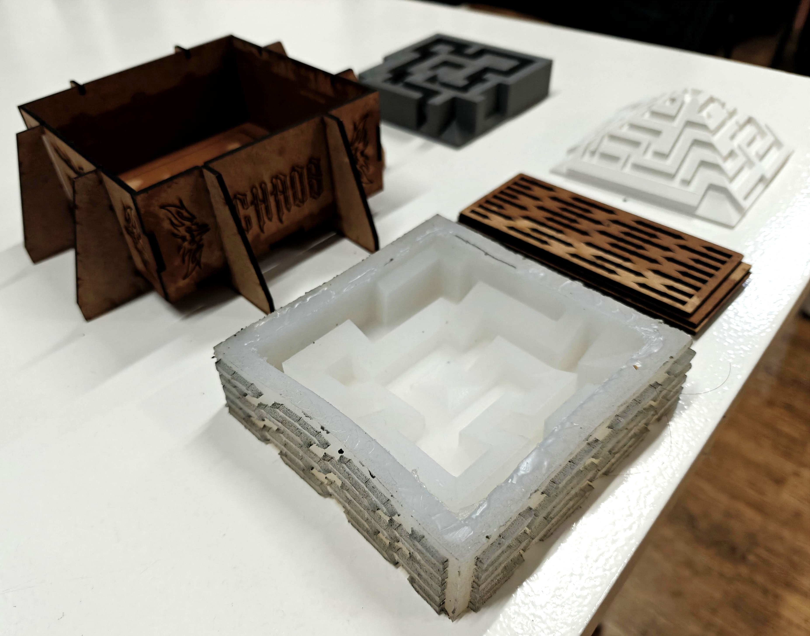

# **Fundamentals for Future Makers**

The fabrication fundamentals course had a series of skill based learning for different methods of fabrication. I worked with Antonio & Erandi on this project.

You can see the work for each step below:

## DAY_01 - LASER CUTTING

??? tip "**Day 01 - Laser Cutting**"

    <!-- ??? abstract "Details" -->
        We were inspired by tattoo art and tattoo style vinyl stickers and graffiti. We decided to use these kind of motifs on the outside of the box, for aesthetic purposes, and created a pattern inside to give the silicon mould some relief. A simple square marking on the base represents the position to place the 3d print for making the silicon mould later on. The laser cutting was fascinating to watch, and it was fun dismantling the pieces and then assembling them into the final box.

    ??? note "Images"

        
        
        
        

## DAY_02 - 3D PRINTING

??? tip "**Day 02 - 3d Printing**"

    <!-- ??? abstract "Details" -->
        For the 3d printing we decided to create something that would have motion and be slightly interactive. We decided to make a maze (Erandi's genius idea) that people could play with. We made a second version in the form of a pyramid (Toni's genius idea), that was very difficult due to the slopes on the pyramid.

    ??? note "Images"

        
        

## DAY_03 - CNC

??? tip "**Day 03 - CNC**"

    <!-- ??? abstract "Details" -->
        We had to CNC to set up a base on which to place our final casting tiles for presenting. We made a simple maze-like pattern for an aesthetic finish that would support our final piece when ready.

    ??? note "Images"

        

## DAY_04 - MOLD MAKING

??? tip "**Day 04 - Silicon Mould making**"

    <!-- ??? abstract "Details" -->
        We created a mould using the laser-cut box and the 3d printed maze, pouring silicon into the space between. This process was challenging as preparing the silicon itself required endless mixing and stirring, and had a tendency to get messy. The other challenge was that the box leaked a bit of silicon owing to small gaps between the assembled pieces.

    ??? note "Images"

        
        
        

## DAY_05 - CASTING

??? tip "**Day 05 - Biomaterial Casting**"

    <!-- ??? abstract "Details" -->
        We created a pine resin formula for casting in our silicon mould. The process had many steps and ingredients, which can be found in the 'Recipe' section below. It was challenging as it was entirely new for me, but was a fascinating process and it was great to see the end result. Although the end result did not turn out as expected, it was a good learning experience, and I experimented further, which you can see in the 'explorations' tab under Fabrication.

    ??? example "RECIPE"

        **Ingredients**

        * 50% pine resin
        * 45% filler (orange peel mix + dried avocado seeds)
        * 5% casting wax
        * Alcohol (solvent for pine resin)

        **Process**

        1. Crush the pine resin to chunks to make it easier to melt.
        2. Heat it in a pot while adding sufficient alcohol. Cover and stir occasionally until entirely dissolved.
        3. Add the casting wax flakes to the mix.
        4. Mix in the filler right at the end and get ready to pour.
        5. Pour the mix into the mould. Lifting and lightly tapping the mould against the table helps the mix settle in and fill the gaps.
        6. Let it dry for 1-2 days (or more) before removing from the mould.

    ??? note "Images"

        
