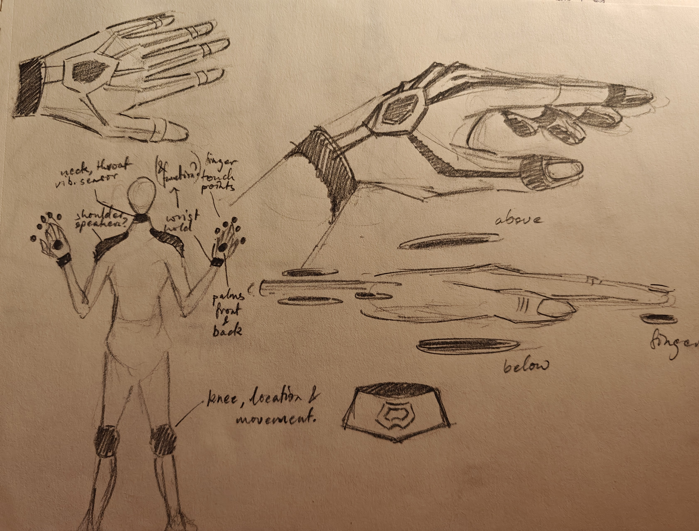
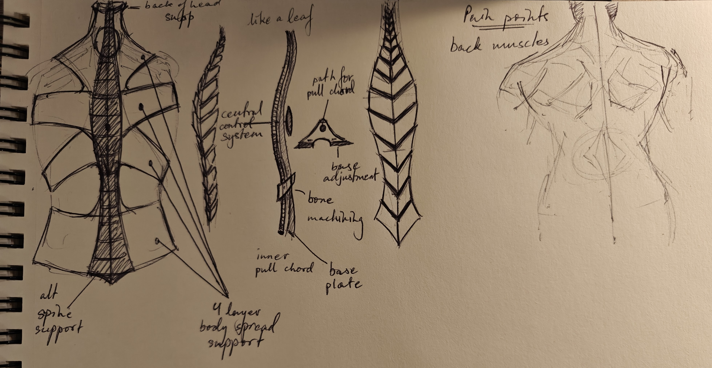
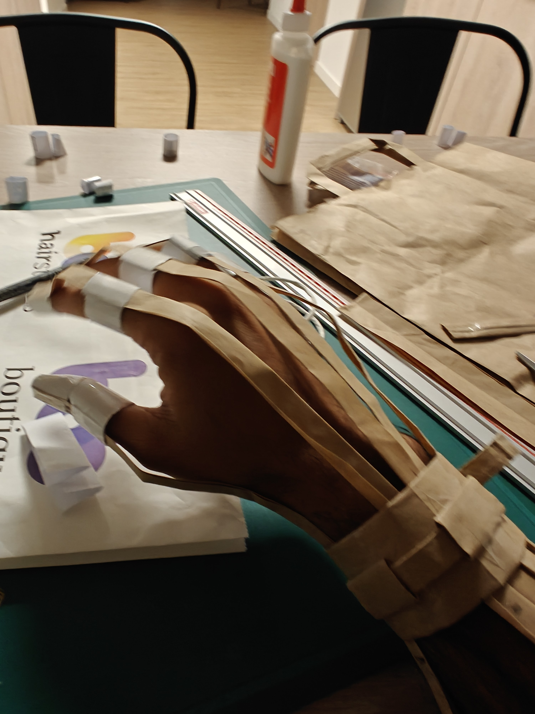
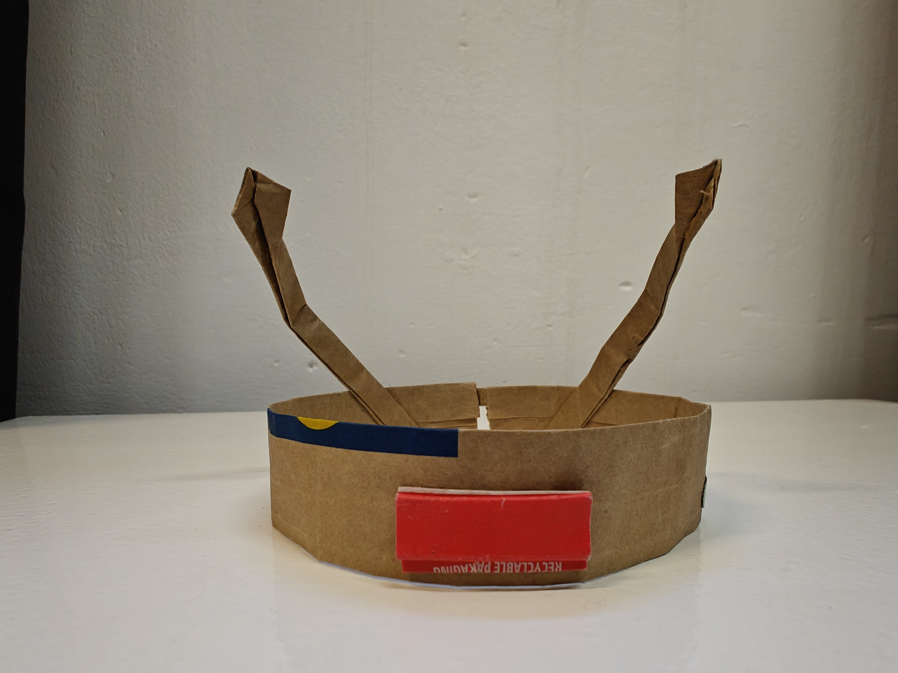
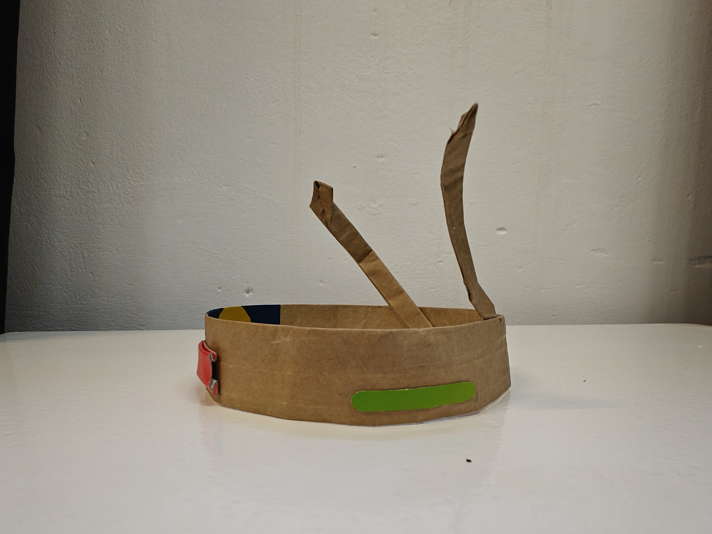
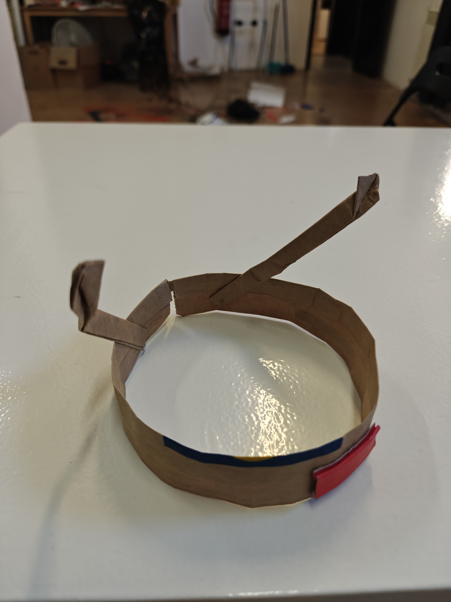

# **Reflections_01 - Living With Your Own Ideas**

!!! tip inline end ""

    

This course was fascinating. It was eye-opening to meet and hear the views of Manuel and Thomas. Their views were incredibly different from each other, and it was inspiring to face these conflicting ideas and to conceptualise our own version of them. I have never been able to live with my own ideas in a sense, and I also have to many of them. I've even created a board on Trello called the Graveyard of Ideas, which features many of the ideas I have had that I have never been able to bring to life. This course allowed me to explore these thoughts and play with them, which was an amazing learning experience for me.

## **DAY_01**

!!! example inline end ""

    

**To be a better version of one's self.**

### Concept

At first I had considered 3 very different ideas, including a robotic spine that could assist our movements and support us further, a set of prosthetics to allow a person to become into a musical instrument, and a mask with multiple settings built to survive delhi pollution. I wanted to prototype all the ideas at first, but with the limited time I had it was too ambitious. I decided to go with the musical instrument, and decided to imbibe this into my very being for this project. I have always been fascinated by musical instruments, and for a long time have wanted to build one.

### 3 Ideas

=== "Musical Instrument"

    The entire body would be used as a part of a digital instrument through multiple connected interfaces.

    

=== "Robotic Spine"

    The robotic spine would support daily activities and movement, also allowing increased strength later into our lives.

    

=== "The Ultimate Pollution Mask"

    This mask would be built for Delhi pollution, and Delhi air in general, and would have settings to change the filters. It would be built into the jaw, and new masks could be connected based on the need. This would allow filtering in 250+ aqi, filter out smells, etc.

    

### Final Idea

What if I could be a muscial instrument from head to toe?

I decided to go all the way with this one and build myself into a musical instrument. The basic idea was to be able to play music anywhere, anytime with complete access and control.

The entire body would be used as a part of a digital instrument through multiple connected interfaces. The components at the hands and feet would allow playing music anywhere anytime. Positioning the knee components would allow changing the system, like choosing instruments etc. The neck component would pick up vocal vibrations and convert them into sound, or use them to control sound. The shoulders would host speakers.

I could suddenly play an air violin or guitar, or tap a table with my fingers and voila! Drums! I could sing over this, and the throat piece would pick up the vibrations and add any effects that I could control with my hads again. The neck piece also has two bone-conduction connectors that sit behind the ears allowing one to hear the sound clearly. It would also allow voice commands and control directly from there. Which area has what instruments would be controlled with the knees. If i sit at a table and use my hands, the positioning of the hands relative to the knees would decide the instrument. Like there is a layout of imaginary instruments on the table from before.

### Sketches & Prototypes

Here are the details of the idea from the sketches and rough prototypes of the hand and the neck piece to get a feel of the instrument and body additions:

??? tip "Concept"

    
    
    

??? note "Hands"

    
    
    

??? note "Choker"

    
    
    

## **DAY_02**

!!! inline end ""

    

**To become something else.**

To be beyond human, was an exciting prospect. I don't think I want to be a goat, but I have certainly imagined being something more than human. This was a difficult one to decide, and I spent a lot of time thinking. To try and get somewhere, I tried to think of the most out-of-body and mind experience I have ever had. The most disconnected I have felt from the idea of being human. And with this I remembered my experience paragliding in the hills of Bir Billing back in India a few years ago. I was so scared for days before, but when we finally jumped off the side of the mountain, everything changed. It was the calmest most peaceful experience. The slow and soft whistling of the wind, the untouched forests high up in the mountains, the snow-capped peaks hiding between the clouds. We went through a cloud, and as we came out, the entire valley was suddenly revealed. It felt like I could see the entire country, far far away. All problems were so far, everything that made me feel chained down was far down below. Since then I have had dreams of wanting to fly and of a home hanging from a cliff above clouds.

I was not as happy with my prototype for the second day as it was a bit rushed and I feel I was not able to capture the feeling that had led me to this concept. Maybe I could have used cotton and cushioning to make the wings feel more like clouds? It was fun to make them fold into themselves.

??? tip "The wings"

    

## **DAY_03**

=== "Detecting Max"

    Why was the suspect wearing a garbage bag? Why did she not speak the entire time? What were her real intentions? Stay tuned to find out as I play detective and see what the suspect is truly hiding.

    -   **12:20**
        Suspect is wearing the trash bag, using phone near secret stairs in the MDEF classroom.
        Puts on trash bag prototype,
        Exits, and goes to the rooftop.
        Texting/writing, chat with Lo, joins group

    -   **12:25**
        Interaction with the suspect, gave me a piece of trash (a cardboard strip). Did not speak or answer my questions (very unlike her).
        Standing in the corner for a while, seems to not be talking (to me at least, based on my interaction).
        Joined a group

    -   **12:28**
        Went downstairs, I give a short gap and follow.

    -   **12:30**
        Lost eyes on subject.
        Hiding in the secret staircase?
        Not there

    -   **12:44**
        Searched every corner of IAAC and the street outside, subject nowhere to be seen.

    -   **12:55**
        Subject located, eating lunch at the bocadillo shop. Reported by Alejandra - still not talking and handing trash scraps.
        Has been writing continuously,
        In class writing.

    -   **After:**
        Unfortunately I was not able to deduce the true intentions and activities of the suspect (or even keep my eyes on her throughout the time).

=== "As The Subject"

    Hiding from my detective. I suspect Mel.

    -   **1:00**
        I see her on the rooftop,
        She came down when I did, went to the side near the bathroom, she ran up maybe she thought I went to the roof. I'm sure it's Mel.

    -   **1:13**
        I came to alt steps and hiding.
        I seem to have given my detective the slip.
        The detective doesn't seem to be bothered.

    -   **After:**
        I was wrong about my detective. It was not Mel. It was Ludo.
        In hindsight, it was very sad to not be chased by the detective after hiding. It was relatively anticlimactic. Maybe I should have done a weird act of some sort instead.

## **NOTES**

!!! tip "Notes from the 3 Days"

    
    
    
    
    
