# **Prototyping the Actions**

In order to understand my context better and filter it into concrete ideas to work with, I started with an initial research. I looked into a variety of creative protests and movements around the world to try and observe alternate methodologies that had been put into practice before. During this process I found it fascinating too see alternative methods of organisation, communication and action between the protesters themselves. Sometimes the protests were beautifully disguised, like in the case of the origin of Capoeira, and sometimes absurd yet effective, like the Chipko Movement. As I went through a variety of these, I realised there was an abundance of such examples with a lot of details for each. I immediately thought of putting these together in a google sheet to make my life easier, and also because it might be useful to someone else in the future. I then realised that an accessible and thorough database could be a powerful tool for people around the world. This process itself led to the first concrete output, the **Creative Protest Database**.

# **Creative Protest Database**

To create a quick prototype, I got ChatGPT to make me an excel sheet and add in some information. I gave it four examples that I was well aquainted with, and asked it to collate specific parameters like the creative methodology used, involved parties, the overall impact, and more. Although it wasn't aesthetic, it had a good amount of information which was well organised. The first output was mostly workable, although there were too many columns with information I didn't need. I wanted to find a way to disguise and hide the database in plain sight as a game, or maybe an alternative experience of some sort. I eventually kept this project aside for another time, especially as my interest in working with methods of communications and encoding them increased.

??? note "The Database"

    

As I worked with this data, I realised that many people who were in the situations where they needed to raise their voices and fight against a system of control, they rarely had access to such information or resources. With this I started conceptualising how this could be available secretly or even hidden in plain sight. Could I hide it behind a videogame? With this I started thinking about how censorship is used by systems of control to manipulate and stifle any kind of dissent, and this led me to working with **coded communication**

# **Coded Communication**

!!! tip inline end ""

    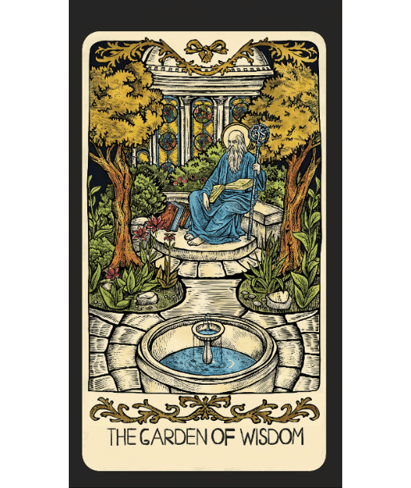

I struggled a lot with trying to figure out an action for this one. At first, I created a notifications app to help carry out or share actions with a group, then I developed secret codes hidden in tarot cards. When I wasn't sure how to practice an action with the tarot cards, I went back to the app and developed it further.

## Zap! - Evolving Notifications App

For the notifications app, I kept it simple with three actions where clicking any button would give the entire group a notification.

With this I realised that there needs to be some form of encoding, or it would become immediately obvious what the purpose of the app was. For this I disguised the icons as random and absurd icons which would make sense to no one:

After this I decided to add in even more randomness, with buttons which keep changing. Each button has a fixed colour and associated meaning that may be decided upon by the users beforehand, but the text and icons would keep changing. The last button would change all the text and icons of the other buttons. Here is the next version and a little video to show its working. I lovingly started calling this app Zap!

??? tip "Zap! - Video"

    [Zap!](https://drive.google.com/file/d/1GRIKLYVkYkkSHSU1g-K7WyMx9X29GpeZ/view?usp=drive_link)

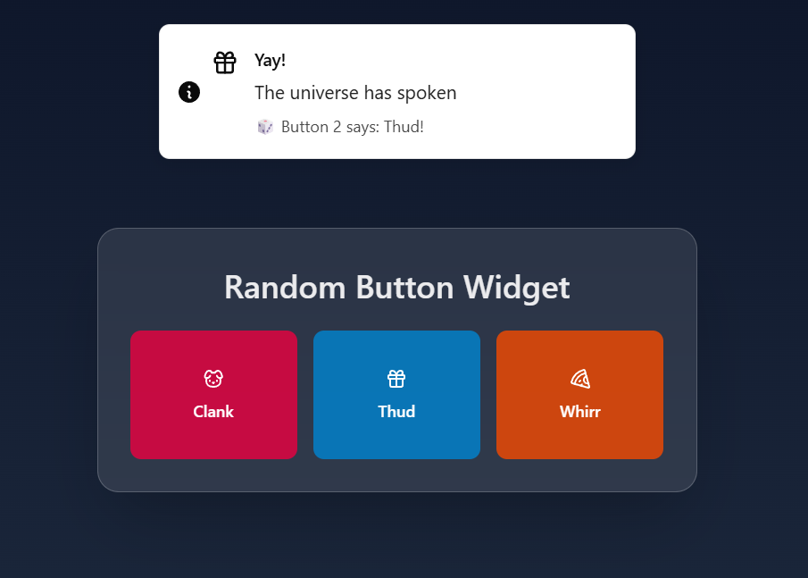

Assigning actions to the 5 colours was the next step (the sixth, mustard, is the randomiser so it won’t have a meaning). To test on myself, I decided to have only 4 meanings to keep it simple:

Red - Engage
Blue - Blend
Orange - Scatter
Purple - Hide

## Tarot Cards

At first I tried to create cards with images, where only a set of people would know the code and meaning behind it. These could be used effectively to move around, scatter or blend into a crowd during a protest. I realised these would not be very effective as physical cards, so I also wanted to create digital versions, but there was an even bigger problem. The cards were fixed so every time a new set was introduced, the rules needed to be shared, and the old set can still be compromised, revealing the system. This is when I decided to test a constantly evolving, and ever-changing system.

The tarot cards will serve as a form of coded communication to suggest actions, locations, and key figures for protest. Actions would be like gather, scatter, be alert, warning, police approaching, blend into the crowd, be silent, or hide. Locations would be like - Main Hideout, Oppressor's Headquarters, Plaza, Public spaces (1, 2, 3,etc), Garden, Meeting room, Paths (1,2,3, etc.). Character cards (friendly and opposing cards for each) would include Leaders, Comms person, groups (small, medium, large), other supporters (largest group).

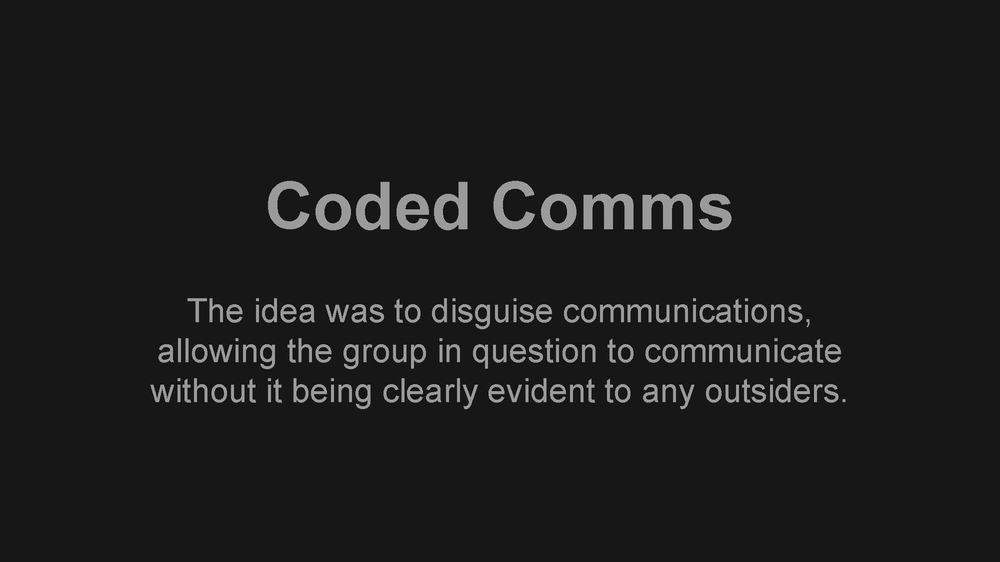

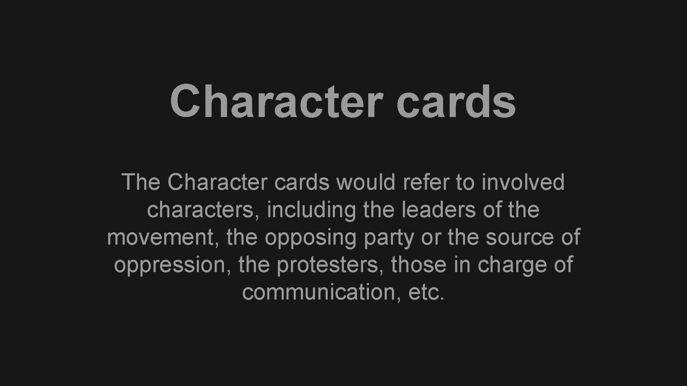

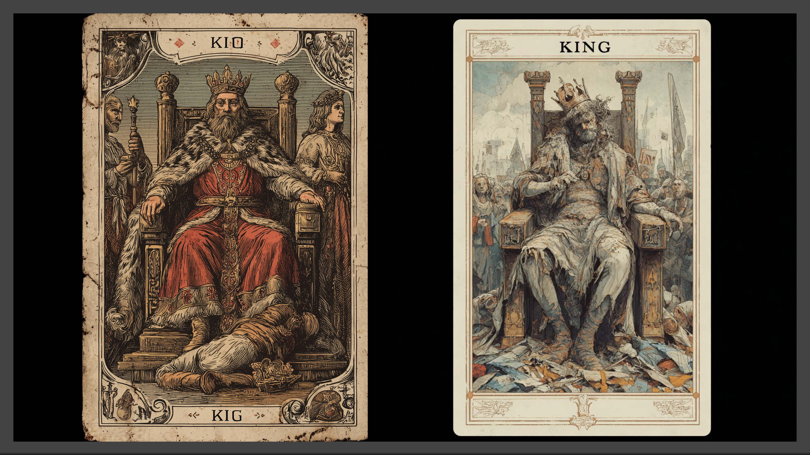
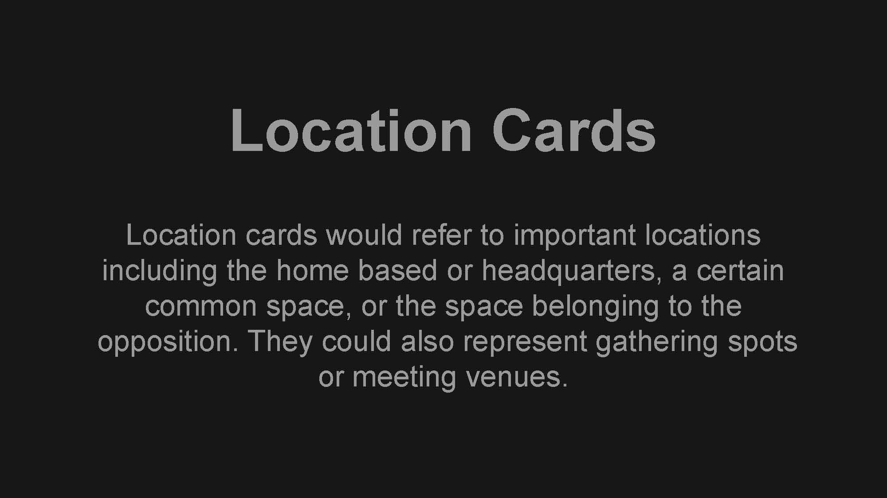

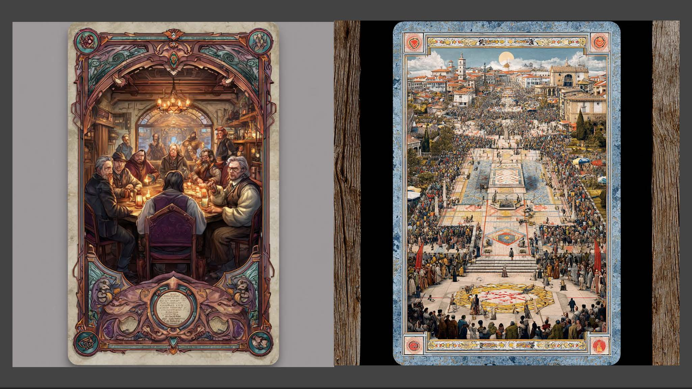
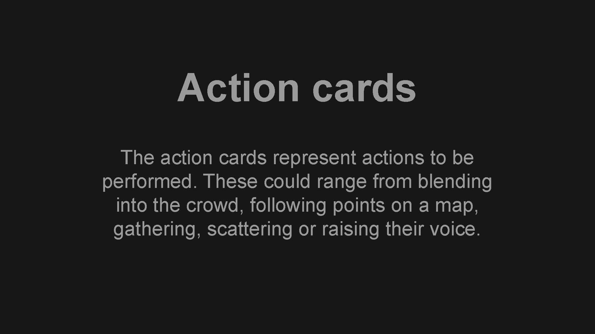
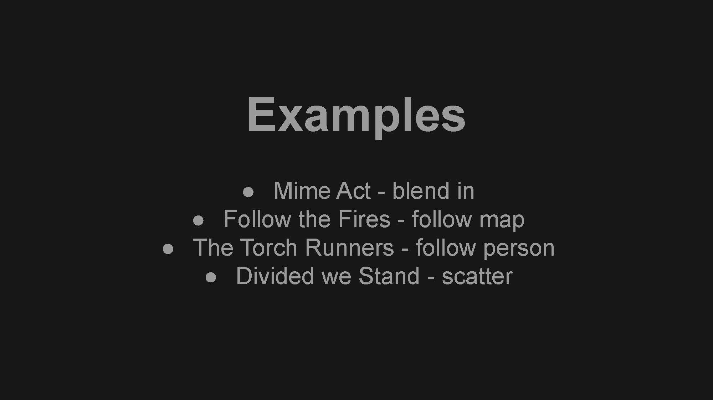
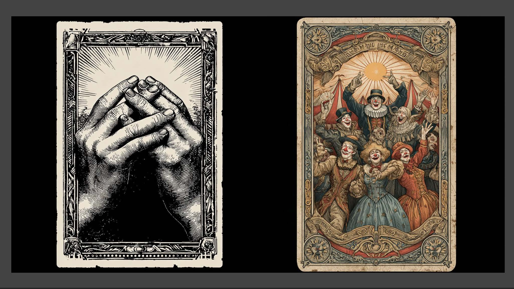

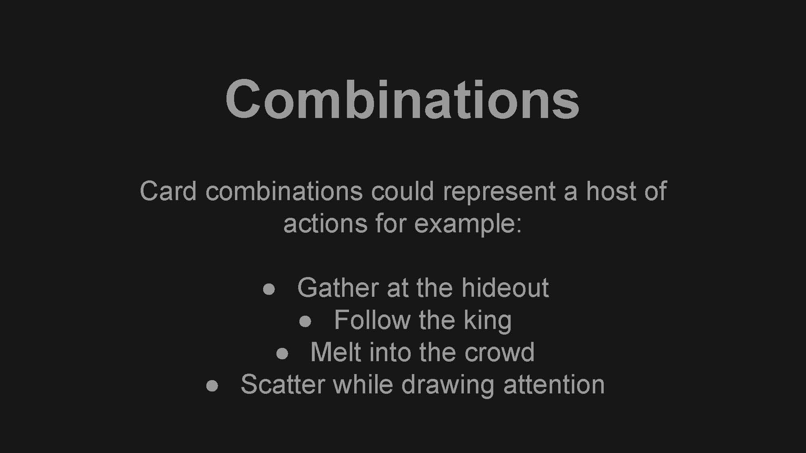

